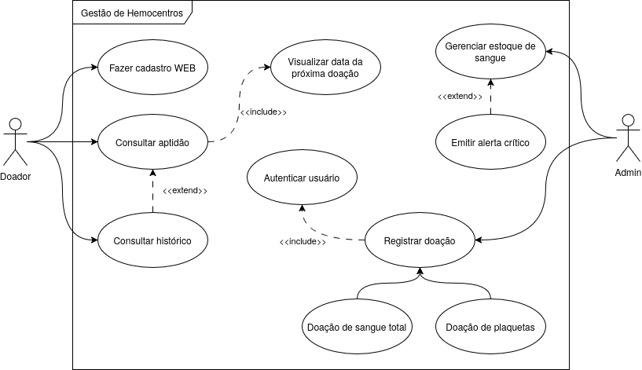

# Sistema de Gestão de Hemocentro - ODS 3

## 🎯 Objetivo e Problema
Este projeto aborda o **ODS 3 (Saúde e Bem-Estar)**. O problema identificado é a instabilidade dos estoques de sangue em hemocentros devido à dificuldade de comunicação direta com doadores aptos.

## 💡 Solução Proposta
Uma **aplicação Web Full-Stack** composta por um dashboard administrativo para o hemocentro gerir o estoque e uma área do doador para consulta de informações e aptidão.

## 🛠 Justificativa Técnica
A escolha por uma solução Web (Angular + Node.js) visa a acessibilidade universal sem necessidade de instalação, facilitando o uso tanto para administradores em desktops quanto para doadores em navegadores mobile.

## 📋 Requisitos do Sistema
Os requisitos detalhados estão disponíveis em [docs/requirements.md](docs/requirements.md).

## 📊 Diagrama de Casos de Uso

